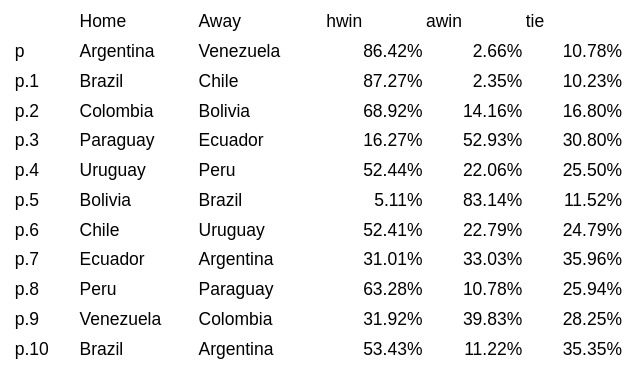
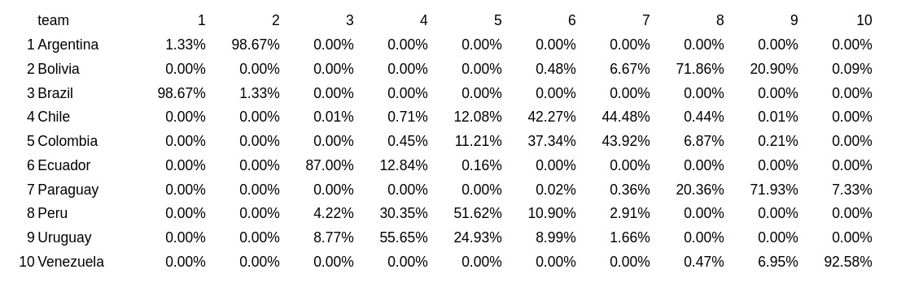
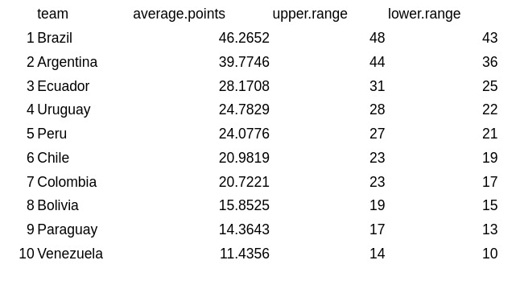
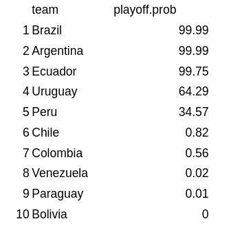

# FIFA World Cup Qatar 2022 - South America qualifiers probabilities

This project is just a modification of [2017-playoff-probabilities](https://github.com/kcm30/2017-playoff-probabilities).

## Run

- Edit files in [input](./input)
- Run:

```
mkdir -p intermediate
mkdir -p output
Rscript run.R
```

- Check output files in the output directory

## Current probabilities

These are the current probabilities (01/29/2021) after match day 15 and 1 match pending between Brazil and Argentina.

### Matches



### Positions



### Points



### Qualification


